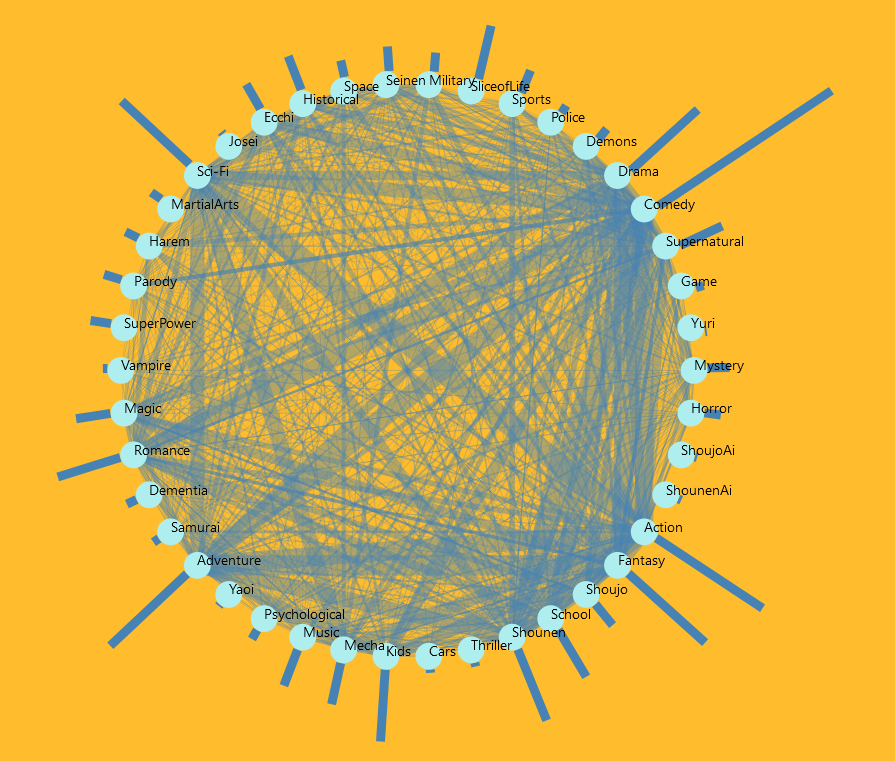
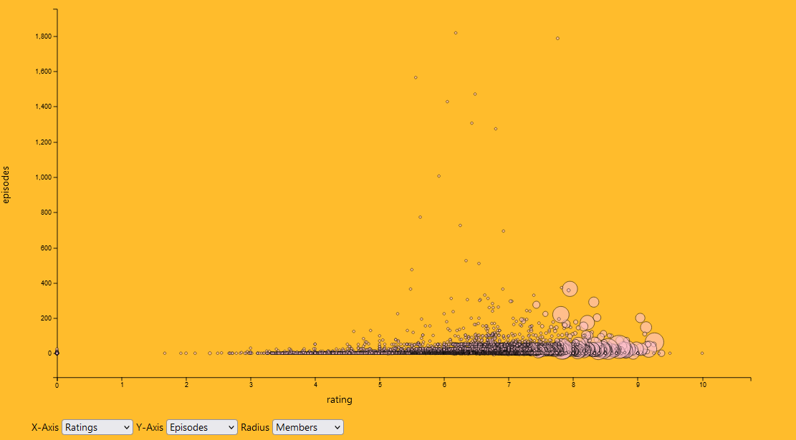

# Anime Analysis
   Authors: Tyler Roten, Miguel Garcia-Peguero, Austin Frost

## Overview:
This project we were tasked with creating a unique analytics dashboard for a given dataset. The data set chosen was [Anime Recommendations Database](https://www.kaggle.com/datasets/CooperUnion/anime-recommendations-database?select=rating.csv) with the goal of exploring popularity trends in anime based on various metrics and find recommendations catered to any user based on their own exploration of the data. The dashboard consists of four graphs all rendered using the D3 javascript library on a web based platform using HTML to present the board and CSS to enhance it. The dashboard primarily focuses around genre exploration and the trends related to anime genres as it can often be a difficult landscape to navigate with so many options available to users. This tool will help guide users to find excellent quality anime catered to whatever taste the user would like and find unexpected trends with their existing favorites.
 
## Data Description:
The data contained in the [Anime Recommendations Database](https://www.kaggle.com/datasets/CooperUnion/anime-recommendations-database?select=rating.csv) is the user preference of 73,516 users on 12,296 anime. These are distributed across two tables. A third graph data set was derived from the original Anime Recommendations Database for a total of three datasets.
 
The first dataset from the original database, called anime.csv, contains the data on each anime including numerical values like rating, episodes, and members. It also contains the list of all related genres for each anime and a string with the platform in which it aired on. Although there are additional attributes they will not be used for this project. Each row in this table represents a unique anime with 12296 anime total. Each column represents an attribute about the anime for a total of seven (cardinality 7). The attributes primarily used from this dataset was the name of the anime, the type (release format), the ratings and the members (active subscribers to that anime).
 
The second dataset from the original dataset was not used for the purposes of this project. It was simply bundled in the [Anime Recommendations Database](https://www.kaggle.com/datasets/CooperUnion/anime-recommendations-database?select=rating.csv).
 
The third data set was derived using the data from anime.csv to create a graph of all related genres. Python was used to find the number of times pairs of genres appeared together in an anime and produced a csv containing the pair of animes and the number of times they are seen together. Each row represents two unique anime that were seen together. The total scale of the data set had 603 rows each with three columns (cardinality 3)
 
## Goals:
This dashboard has two primary intended goals. The first is for anime enthusiasts to explore current popularity trends in anime and see how their favorite anime compare to others. The second goal is for any one wanting to find an anime to watch, whether it be an enthusiast or someone new to the anime world, based on their own interests at that time in an exploratory manner. This allows users to have some control over the recommendation rather than just receiving one from an automated system.
## Idioms:
The interface consists of four graphs all revolving around the idea of genres. There are some controls for each individual chart that allow for further drill down and analysis of the various performance metrics.
 
**Chord Bar Chart-** The chord bar chart consists of a chord chart that shows how similar various genre types are based on the number of times one genre term is seen with another. The link thickness represents how many times terms are seen together and each node is a genre term. Additionally, each node has a bar chart showing the number of times that genre is seen in any anime. The chart also allows you to select multiple nodes or genres to filter in only data with those genres. This chart serves as the center of the whole dashboard.

 
**Scatter Plot-** The mind gap scatter plot serves as the second most important feature in the dashboard. It allows for users to compare relationships in the anime based on various features including: episodes, members, and ratings. The user can select what data they want encoded in the three features of x position, y position and radius of point. Additionally, the scatter plot is linked to the chord chart allowing for the data to be filtered by the selected genres.

 

**Bar Chart-** The bar chart provides a way to see the distribution of ratings based on the number of members or subscribers. The length of the chart is the quantity of members that have the rating given by the x position. This data is binned and allows for you to see trends in the primary metric systems for popularity being members or subscribers and ratings. Additionally, the chart is linked to the chord chart allowing data to be filtered by the genres selected.

 

**Pie Chart-** The pie chart allows for users to see what the most popular type or format of the anime was. The area of the slices of the circles represent the proportion of anime that were released in that format. This chart is also linked to the chord chart and uses it to filter the data represented.

 
## Reflection:
On initiating the project we had a very clear schedule to complete the project but very soon fell behind one week from the schedule. Thankfully we allowed for a week of slack in the schedule meaning we would still make our deadline. This allowed us to have a solid framework by the time we got to the WIP with the scatter and bar charts mostly complete and the styling mostly done. At this point some of the goals changed due to the difficulty of implementing including the style of circular bar chart around the scatter plot, the tensioning of connections along the chord chart, and the location of our pie chart which was intended to be a tool tip. After these changes we were able to get a finished product a few days before the presentation. Compared to our original proposal, our final product was pretty close with just the only changes being cosmetic changes discussed after the wip. All the encoding and interactions remained as intended. The largest challenge that arose was the implementation of the chord chart which none of our team had ever created. This resulted in abandoning the tension in the connections of the chord chart to make the deadline. As well as the circular pi chart format around the chrd chart in favor of a regular bar chart around the circle due to time constraints. In order to avoid this in projects going forward I will likely do some upfront research on how to implement the features we were going to propose before proposing them because the research time was not included when we estimated the timeline to complete the project.
 
## Workload:
 
**Miguel-** Responsible for all project documentation, data preprocessing and creating the scatter plot along with linking and implementing the tooltip for the chart.
 
**Tyler-** Responsible for chord bar chart, tooltip and selection feature for chord chart and styling
 
**Austin-** Responsible for Bar chart, pie chart, and creating helper functions to link charts using filtered data